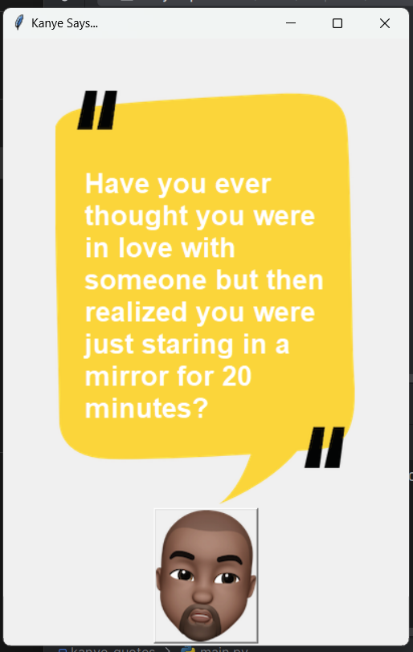

# Kanye Quotes

One of my first GUI apps showcasing Kanye's legendary quotes.

### Prerequisites

- Python 3.9 and up
- Libraries: `Tkinter` and `requests`
- Kanye Quotes REST API

### Setup

- Clone the project files and change into the project directory:

    ```bash
    git clone https://github.com/SourasishBasu/kanye-quotes.git
    cd kanye-quotes
    python -m venv venv
    ./venv/Scripts/activate
    pip install -r requirements.txt
    ```

- Run the app

    ```bash
    python main.py
    ```

### Usage



<p>Click the Kanye button to generate quotes</p>